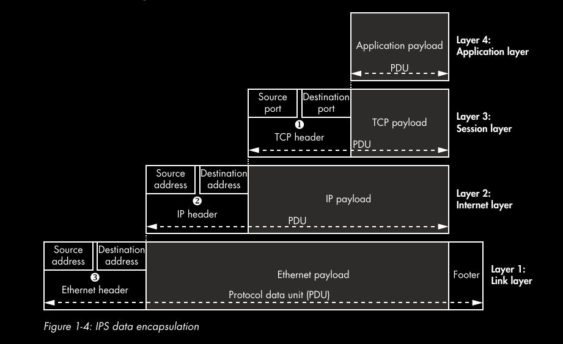

## Database Synchronization

### Shared Disk Failover

*   Uses a single disk array shared by multiple servers, if main db server fails, the standby mounts the disk and starts the db as if recovering from crash.
*   Standby server should never access the shared storage while the primary server is running

PROS

*   Rapid failover with no data loss

CONS

*   If the shared disk array fails or becomes corrupt, the primary and standby servers are nonfunctional.

### File System ( Block-Device ) Replication

*   All changes to a file system are mirrored to a file system residing on another computer.
*   Mirroring must be done in a way that ensures the standby server has a consistent copy of the file system -> writes on the standby must be done in the same order as writes to master.

### Warm and Hot Standby Using Point-In-Time Recover ( PITR )

*   Standby servers are kept current by reading a stream of write-ahead-log records (WALs).
*   Can be implemented using file-based log shipping, streaming replication, or combination of both.

PROS

*   If main server fails, standby contains almost all the data of the main server, and can quickly be made the new master db.

### Trigger-Based Master-Standby Replication

*   Master-standby replication setup sends all data modification queries to the master server
*   Master server asynchronously sends data changes to the standby server
*   Server can answer read-only queries while the master server is running

### Statement-Based Replication Middleware

*   A program intercepts every SQL query and sends it to one or all servers
*   Each server operates independently, R/W queries are sent to all servers, read-only queries can be sent to just one server
*   Functions like random and CURRENT_TIMESTAMP will differ across servers, if same values are necessary, middleware must query a single server to get the values and then use those values in broadcast queries

### Asynchronous Multimaster Replication

*   Each server works independently and periodically communicates with the other servers to identify conflicting transactions
*   Conflicts are resolved by users or conflict resolution rules

PROS

*   Good for servers that aren't regularly connected like laptops or remote servers

### Synchronous Multimaster Replication

*   Each server can accept write requests and modified data is transmitted from the original server to every other server before each transaction commits.
*   Works best for mostly read workloads.

CONS

*   Heavy write activity can cause excessive locking, leading to poor performance.
*   Write perf is often worse than that of a single server.

## Transactions

A transaction is a set of database reads and writes that is handled as a unit with a few crucial properties. Reads in the transaction see the same snapshot of the data base, writes within a transaction either all succeed or all fail, after a transaction succeeds, the writes are permanently stored.

[Foundation DB's Transaction Manifesto](https://apple.github.io/foundationdb/transaction-manifesto.html)

It is becoming clear that supporting transactions is a matter of engineering effort, not a fundamental trade off in the design space.

[Foundation DB's Transaction Manifesto](https://apple.github.io/foundationdb/transaction-manifesto.html)

FoundationDB decouples its data storage technology from its data model.

# High Level Overview of Dist. Systems

There are two basic tasks that nay computer system needs to accomplish:

*   Storage
*   Computation

The performance advantage of high-end hardware is limited in tasks that require large amounts of communication between nodes.

**Scalability:** The ability of a system, network, or process, to handle a growing amount of work in a capable manner or its ability to be enlarged to accommodate that growth.

In distributed systems there are two types of latency that cannot be overcome:

*   The speed of light
*   Hardware speeds

**`Availability = uptime / (uptime + downtime)`**

*   an increase in the number of independent nodes increases the probability of failure in a system (reducing availability and increasing administrative costs)
*   an increase in the number of independent nodes may increase the need for communication between nodes (reducing performance as scale increases)
*   an increase in geographic distance increases the minimum latency for communication between distant nodes (reducing performance for certain operations)

## FLP Impossibility Result

Examines the consensus problem under the asynchronous system model. It is assumed that nodes can only fail by crashing; that the network is reliable, and that the typical timing assumptions of the synchronous system model hold: e.g. there are no bounds on message delay.

there does not exist a (deterministic) algorithm for the consensus problem in an asynchronous system subject to failures, even if messages can never be lost, at most one process may fail, and it can only fail by crashing (stopping executing).

## CAP Theorem

# Network Architecture and Protocols

### PURPOSES OF NETWORK PROTOCOLS

*   Maintaining session state
*   Identifying nodes through addressing
*   Controlling flow
*   Guaranteeing the order of transmitted data
*   Detecting and correcting errors
*   Formatting and encoding data

### Internet Protocol Suite

**Link Layer:** Ethernet PPP

**Internet Layer:** IPv4, IPv6

**Transport Layer:** TCP, UDP

**Application Layer:** HTTP, SMTP, DNS

**Service Multiplexing** allows a single node to support multiple different services by assigning a different number for each service; this number is called a port.

*   Each layer in the IPS is built on the one below, and each layer is able to encapsulate the data from the layer above so it can move between the layers.

**Default Gateway** is the catchall IP address to which a router can send IP packets

## ALTERNATIVE MODEL

*   **Content Layer:**  Provides the meaning of what is being communicated
*   **Encoding layer:** Provides the rules to govern how you represent your content
*   **Transport layer:** Provides rules to govern how data is transferred between the nodes.

# CAPTURING NETWORK TRAFFIC

Passive network capture via tools like wireshark

### Tracing System Calls

Common Unix Systems Calls for Networking

*   **Socket**: creates a new socket fd
*   **Connect:** connects a socket to a known IP address and port
*   **Bind:** binds the socket to a local known IP address and port
*   **Recv, read, recvfrom** Receives data from the network via the socket. The generic function `read` is for reading from a fd, whereas `recv` and `recvfrom` are specific to the socket's API.
*   **Send,write, sendfrom:** Sends data over the network via the socket

### Types of Network Proxies

**Port Forwarding**: set up a listening server and wait for a new connection. When the new connection is made to the proxy server, it will open a forwarding connection to the real service and connect the two.

**SOCKS Proxy:** Forwards TCP connections to the desired network location, and all new connections start with a simple handshake protocol that informs the proxy of the ultimate destination rather than having it fixed. It also supports listening connections. Generally preserves the destination of the connection from the point of view of the client application.

**HTTP Proxy:** HTTP can be co-opted as a transport mechanism for non-web protocols like RMI and RTMP because it can tunnel through most restrictive firewalls. Two main types of HTTP proxy: forwarding proxy and reverse proxy. CONNECT HTTP method creates transparent, tunnelled connections over HTTP proxies. HTTP proxies can be used to tunnel out an application's own binary protocols, so it's common to find deployments of HTTP proxies restricting the ports that can be tunnelled to a very limited subset.

## NETWORK PROTOCOL STRUCTURES

**Binary Protocol Structures:** Operate on the single binary digit level though bytes are the defacto unit of network protocols.
